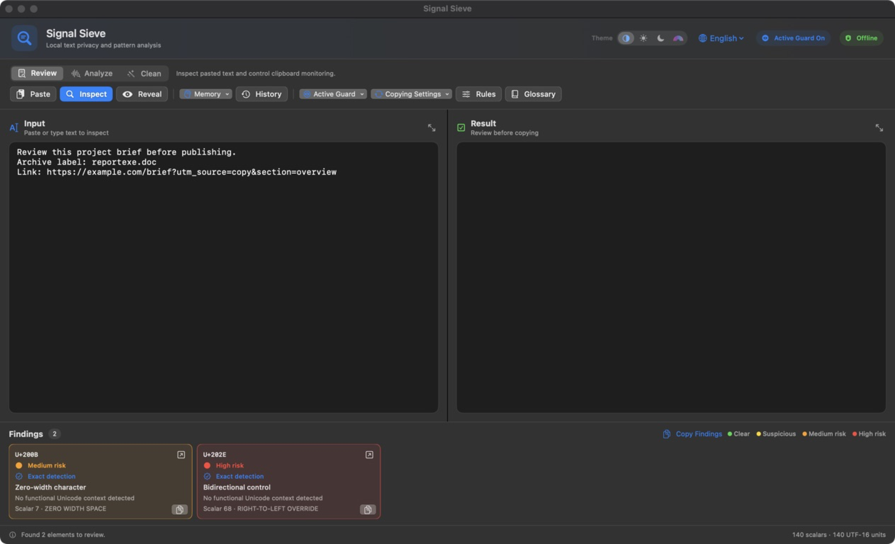
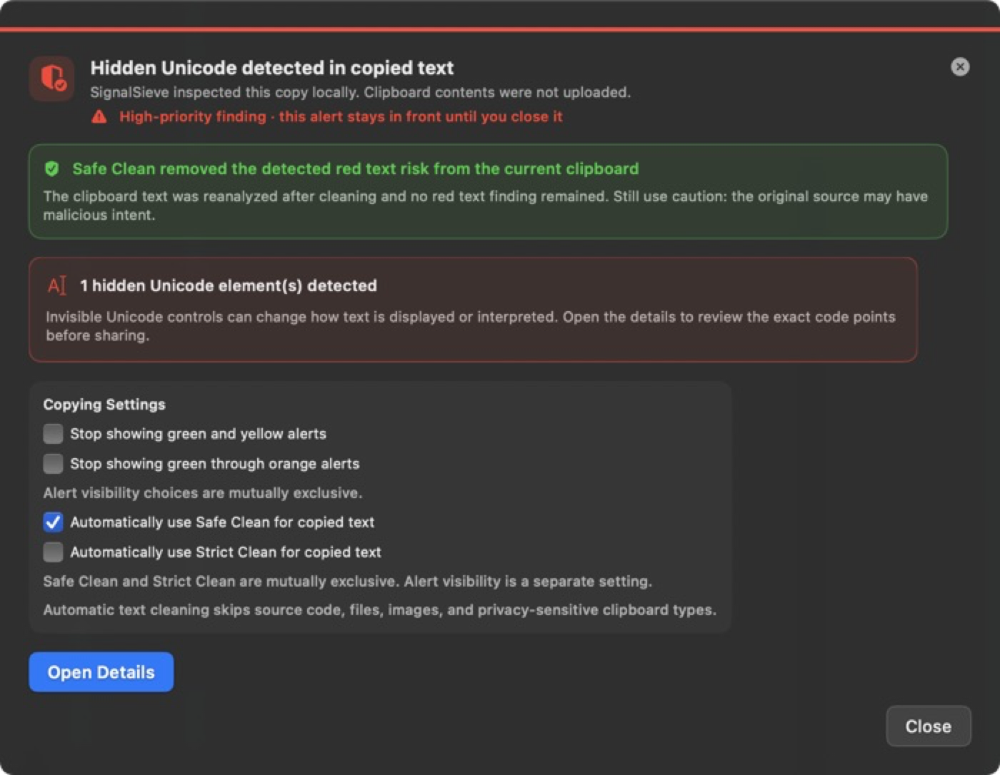
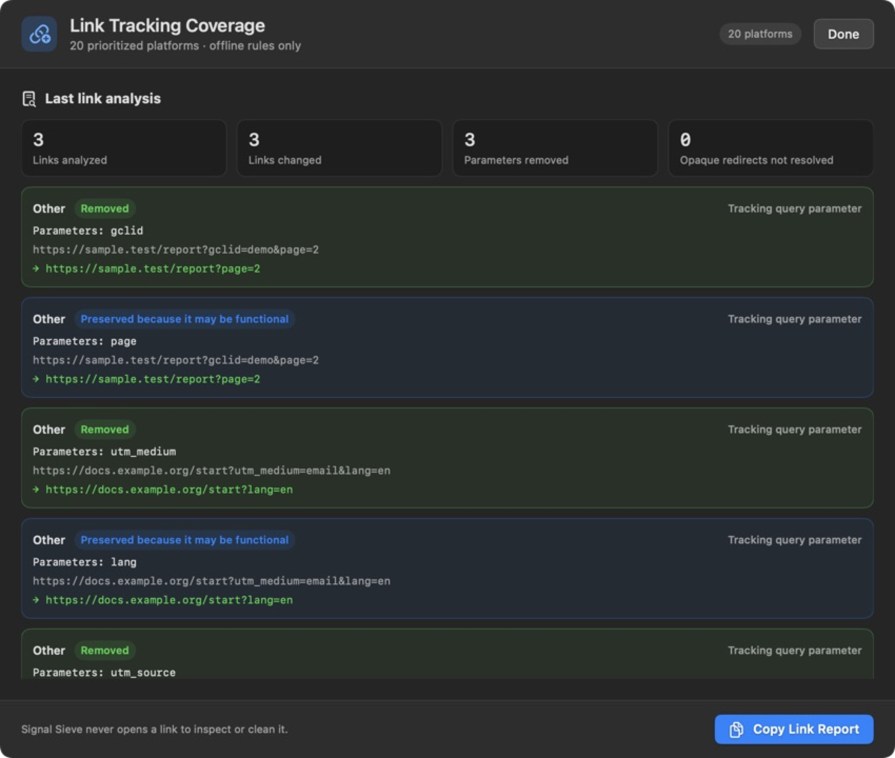

# Signal Sieve

<p align="center">
  
</p>

<p align="center"><strong>Inspect what copied text and files carry before you share them.</strong></p>

<p align="center">
  
</p>

<p align="center"><em>Local, explainable inspection for copied text, links, code, images, and files.</em></p>

Signal Sieve is a privacy-first macOS app for inspecting copied text, code,
links, and file-provenance metadata. Its analyzers make no network requests and
do not save the content you process.

Signal Sieve is an early public release. Reports are evidence for review, not
proof of authorship, malicious intent, AI generation, or guaranteed watermark
removal. Please read [SECURITY.md](SECURITY.md) before using mutation features
on important files.

## Quickstart

On an Apple-silicon Mac, install the latest public build into your personal
Applications folder with the [GitHub CLI](https://cli.github.com/):

```sh
install_root="$(mktemp -d)"
gh release download --repo JACKNINES/SignalSieve --pattern 'Signal-Sieve-*-macOS-arm64.zip' --dir "$install_root"
ditto -x -k "$install_root"/Signal-Sieve-*-macOS-arm64.zip "$install_root/unpacked"
mkdir -p "$HOME/Applications" && ditto "$install_root/unpacked/Signal Sieve.app" "$HOME/Applications/Signal Sieve.app"
```

Launch Signal Sieve and create a safe, synthetic clipboard example in two
lines:

```sh
open "$HOME/Applications/Signal Sieve.app"
printf '%s' 'Review https://example.com/report?utm_source=demo' | pbcopy
```

Active Guard should report the removable `utm_source` tracker without
contacting the example domain. Because the current build is not notarized, the
first launch may require the macOS confirmation described in
[Download the macOS app](#download-the-macos-app). Signal Sieve itself does not
require the GitHub CLI after installation; users who prefer Finder can install
the DMG instead.

## Clear use cases

Signal Sieve is designed for:

- **Privacy-conscious users** reviewing copied text and removing known tracking
  parameters before sharing links.
- **Developers and code reviewers** inspecting source snippets and project
  folders for hidden Unicode, bidirectional controls, confusable identifiers,
  unexpected encodings, and unsafe clipboard representations.
- **Security and watermark researchers** studying deterministic text carriers,
  statistical writing signals, metadata, and optional community detectors with
  explicit evidence and false-positive boundaries.
- **Journalists, educators, and researchers** checking copied material and
  creating clean metadata copies locally before publication or collaboration.
- **Open-source maintainers** who want reproducible tests, reviewable cleaners,
  and an optional compatibility harness for independently maintained engines.

It is not an authorship detector, malware scanner, or guarantee that every
provider-specific watermark has been found or removed.

## Download the macOS app

Download the latest prebuilt application from
[GitHub Releases](https://github.com/JACKNINES/SignalSieve/releases/latest).
The DMG is recommended: open it and drag **Signal Sieve.app** to the Applications
shortcut. A ZIP containing the same app bundle is also provided. The current
automated release supports Apple silicon (`arm64`) only. Both packages include
the pinned PDF helper, so using the prebuilt app does not require Homebrew,
CMake, Swift, or a source checkout.

Each DMG and ZIP includes a neighboring `.sha256` file. You can verify either
package in Terminal from the download folder:

```sh
shasum -a 256 -c Signal-Sieve-*.sha256
```

GitHub also publishes signed build provenance for both packages. With the
[GitHub CLI](https://cli.github.com/) installed, verify the downloaded DMG with:

```sh
gh attestation verify Signal-Sieve-*.dmg -R JACKNINES/SignalSieve
```

The current public build is ad-hoc signed, not notarized with an Apple
Developer ID. On macOS 15 Sequoia and later, first try to open
**Signal Sieve.app** so macOS records the blocked launch. Then open **System
Settings → Privacy & Security**, scroll to **Security**, click **Open Anyway**,
authenticate, and confirm **Open** in the warning that appears. Apple makes
**Open Anyway** available for approximately one hour after the blocked launch.
Do not disable Gatekeeper or remove quarantine attributes globally. See
[Apple's current instructions for opening an unnotarized app](https://support.apple.com/en-lamr/102445).
A future notarized release can remove this extra confirmation.

## See it in action

Signal Sieve does not silently claim that a problem is fixed. Automatic
cleaning is followed by a second local analysis, while link treatment reports
separate removed tracking from parameters that may be functional. The
screenshots below use synthetic English examples and reserved example domains;
they contain no real account, organization, or third-party message data.

<table>
  <tr>
    <td width="50%" align="center">
      <br>
      <strong>Active Guard</strong><br>
      Red alerts stay in front. The green status panel says whether automatic
      cleaning removed the detected text risk.
    </td>
    <td width="50%" align="center">
      <br>
      <strong>Link Treatment Report</strong><br>
      Each URL shows what was removed and which parameters were preserved
      because they may be functional. No destination is contacted.
    </td>
  </tr>
</table>

## Features

- Fresh installations start in English. The language menu switches instantly
  between English, Spanish, and Norwegian Bokmål, and the selected language is
  stored locally for later launches.
- The running application icon follows the selected appearance: black geometry
  on white for Light, white geometry on black for Dark, and iridescent geometry
  on pink for Iridescent Pink. Automatic follows the effective macOS light/dark
  appearance and updates again when the system changes. The signed bundle keeps
  the dark artwork as its stable Finder icon; runtime switching changes only
  the active app and Dock representation.
- Uses the original Signal Sieve lightning-and-sieve `SS` mark across the app,
  its themed icons, and the project documentation.
- **Active Guard:** watches for new clipboard content while SignalSieve is running and
  shows a local, actionable notice for hidden Unicode, source-code risks, known
  link trackers, or a repeated pattern across the latest three substantial
  copies. It also recognizes copied images and file references without claiming
  that metadata was found before inspecting the bytes. **Inspect Copied Image**
  pastes the same bounded image representation directly into File Inspector.
  PNG and JPEG bytes are preserved for metadata analysis; TIFF, HEIC, HEIF, and
  GIF representations are normalized locally to PNG with that limitation shown.
  HTML and rich-text representations are inventoried without retaining values.
- Active Guard colors Unicode and code cards from their actual highest risk.
  Only red, high-risk alerts request immediate attention, move to the front,
  and remain above other windows until the user explicitly closes or reviews
  them. Users can hide green and yellow notifications or hide every tier from
  green through orange. Red alerts remain mandatory.
- **Session Copy History:** keeps up to 50 recent text copies in local memory
  while Active Guard is running. Each entry shows its exact capture time,
  probable source application, a bounded visible preview, character count, and
  detected risks. Automatic text-cleaning entries also show a Clean Receipt and,
  only when the original was eligible for history and not truncated, guarded
  **Copy Clean Result** and **Restore Original** actions. Those actions first
  confirm that the pasteboard still holds the matching clean result; concealed,
  transient, auto-generated, and privacy-sensitive items are never retained for
  restoration. The source is inferred from the active application; macOS
  does not provide a trustworthy browser tab or page URL. Concealed,
  transient, and auto-generated pasteboard entries are not retained, long
  entries are truncated, and all history disappears when Signal Sieve exits.
- **Binary Guard:** detects raw binary signatures and null-byte content, plus
  textual payloads represented as Base64, hexadecimal bytes, binary digits, or
  escaped byte sequences. It reports approximate decoded size but never
  decodes, opens, or executes the payload.
- **Code Guard:** recognizes likely source code and shell commands, then reports
  Trojan Source bidirectional controls, invisible token characters, non-ASCII
  whitespace, rich-text punctuation, mixed writing systems, and common Greek or
  Cyrillic look-alikes inside identifiers.
- Code Guard reports line and column, keeps research queries free of copied
  code, and can create sanitized output for side-by-side review. It never
  guesses replacements for confusable identifiers or modifies code
  automatically. Visual Transfer is disabled for detected code because OCR can
  alter syntax.
- **Language detection:** scores distinctive syntax rather than relying on a
  single keyword. It currently identifies Swift, TypeScript, JavaScript, Rust,
  Python, C, C++, Objective-C, Go, Java, Kotlin, C#, Shell, SQL, Solidity, Move,
  Ruby, PHP, Dart, Lua, HTML, CSS, JSON, YAML, and TOML. Explicit Markdown code
  fences are treated as strong evidence. Short shared syntax remains labeled
  **Source code** instead of forcing a language guess.
- Active Guard can clean the current copied link on demand or automatically
  replace future copied links after removing known tracking parameters. It
  verifies that the clipboard has not changed before replacing anything and
  skips automatic link cleaning when the copied text is source code.
- **Copying Settings** can automatically apply Safe Clean, Strict Clean, or
  Visual Transfer to eligible copied text. The three protocols are mutually
  exclusive. Strict Clean also flattens HTML/RTF clipboard representations to
  plain text, even when the visible characters themselves need no cleanup.
  Automatic Visual Transfer performs the bitmap-to-OCR round trip locally,
  limits input to 4,000 characters, and refuses to overwrite detected changes
  to URLs, numbers, or quotations. Automatic processing skips source code,
  files, images, and privacy-sensitive clipboard types. Deterministic cleaning
  prepares and reanalyzes the candidate before replacing the clipboard. If a
  high-risk finding remains after reanalysis, Signal Sieve leaves the clipboard
  unchanged and marks the copy as quarantined. A red finding that was
  successfully removed may be replaced, but the red source warning still
  appears. The Clean Receipt reports the selected protocol, original and
  remaining alert counts and highest severity, deterministic removed/replaced
  counts, skipped status, and a short content-free reason with progressively
  disclosed technical evidence.
  A green receipt means only that Signal Sieve found no remaining risk covered
  by this cleaning analysis; it is not a malware verdict, authorship proof, or
  guarantee that the source is trustworthy. Visual Transfer uses the same
  receipt and quarantine decision, while its OCR transformation is identified
  separately from deterministic removed/replaced counts.
  Alert visibility is a separate setting: users may hide
  green and yellow alerts, or hide green through orange alerts. The two
  visibility choices are mutually exclusive, and red alerts cannot be disabled.
- **Automatic Input Result** is enabled by default. Pasting or typing in the
  Input editor prepares Result with the selected Safe Clean, Strict Clean, or
  Visual Transfer protocol. OCR is debounced, bounded, and discarded if Input
  or the selected protocol changes before it finishes. With automatic cleaning
  off, Result remains unchanged. It never copies or shares output automatically,
  and the behavior can be disabled from Copying Settings.
- Detects zero-width characters, invisible mathematical operators,
  bidirectional and deprecated directional controls, variation selectors,
  Unicode tags, script fillers, orthographic/layout controls, reserved
  default-ignorables, noncharacters, unusual whitespace, private-use
  characters, and unassigned code points. Context classification distinguishes
  functional emoji composition, script shaping, orthographic marks, glyph
  variation, notation layout, and bounded bidirectional text from floating
  carriers. Green contextual findings remain visible for audit but do not
  trigger warnings or count as hidden-payload risk. See
  [UNICODE_SECURITY.md](UNICODE_SECURITY.md) for the ranges, cleaning policy,
  and false-positive boundaries.
- **Advanced Carrier Lab:** detects relationships that scalar-by-scalar scans
  can miss: a four-symbol zero-width base-4 alphabet, binary alphabets made
  from two space classes, spaces/tabs at line endings, and recurring Cyrillic
  look-alikes inside predominantly Latin text. Decodable content and carrier
  cadence are shown separately from confidence. Safe Clean neutralizes detected
  zero-width, mixed-space, and trailing-whitespace channels; it does not guess
  replacements for confusable visible letters.
- Shows the Unicode code point and position of every finding.
- Every analyzer can copy either its complete findings report or an individual
  finding in a compact plain-text format. Copied reports include risk,
  location, encoding, evidence, fragments, and diffs when available. Invisible
  scalars are written as explicit markers such as `⟦U+200B⟧`, never placed
  invisibly back on the clipboard. Each individual result card has a bordered
  copy control in its lower-right corner.
- Opens a focused DuckDuckGo search when you click a finding. The query includes
  only the Unicode code and element name, never the surrounding text.
- Cleans tracking parameters from links embedded in text while preserving
  functional parameters. This includes `utm_*`, `igsh`, `fbclid`, `gclid`, and
  other widely used campaign identifiers.
- Applies host-scoped share-link rules for Instagram, YouTube, Facebook,
  TikTok, X, Snapchat, Reddit, Threads, Pinterest, and LinkedIn, and unwraps
  known Facebook outbound redirects.
- Detects opaque short-link or redirect domains such as `redd.it`, Reddit
  `/s/`, `pin.it`, `lnkd.in`, `t.snapchat.com`, and `t.co` without contacting
  them. These remain unchanged and are reported as “detected but not
  resolvable offline,” never as successfully cleaned.
- Provides a visible 20-platform coverage matrix and a copyable treatment
  report that distinguishes removed tracking, preserved functional parameters,
  unresolved opaque redirects, and mechanisms outside clipboard scope. See
  [LINK_TRACKING.md](LINK_TRACKING.md) for rule boundaries and source evidence.
- **Pattern Memory:** compares up to ten recent texts for repeated phrases,
  sentence openings, list structures, and punctuation choices. Samples remain
  in memory for the current session only and disappear when the app exits.
- **Surface Regularity (experimental):** performs a local, keyless stylometric
  screen for observable writing patterns in a single text. It measures repeated
  three-word sequences, moving-window lexical diversity, sentence-length
  cadence, and repeated sentence openings. It requires at least 80 words and
  recommends 180 or more. The aggregate value is explicitly a heuristic score,
  not a probability or provider attribution. Provider-watermark status is
  reported separately as untestable without a compatible detector. Hidden
  Unicode is reported as an exact text-layer result. Every signal can open a generic research
  query that never contains the analyzed text, and the full qualified report is
  copyable.
- **Provider profiles:** keeps provider claims separate from local heuristics.
  The current Claude profile records the provider's documented scope while
  leaving the mechanism undisclosed and the compatible detector unintegrated.
  Compatible local statistical detectors now enter through a versioned adapter
  boundary. A selected KGW, SynthID-Text, keyed-Gumbel, or research module runs
  against a private temporary text copy and must identify its exact scheme and
  verification mode. Same-configuration results are never presented as vendor
  attribution. See [TEXT_WATERMARK_MODULES.md](TEXT_WATERMARK_MODULES.md).
- **Community Engines (optional):** connects explicitly to an independently
  installed `watermarks-remover` core service on the fixed numeric loopback
  address `127.0.0.1:8765`. The app supports its documented health,
  capabilities, text inspection, and clean-copy routes; it never downloads,
  launches, or updates the external project. Cleaned text is reanalyzed by
  Signal Sieve before the user may place it in Result. Signal Sieve remains
  fully usable without the service. Setup, update, licensing, and trust details
  are in [COMMUNITY_ENGINES.md](COMMUNITY_ENGINES.md).
- **File Provenance Inspector:** performs a bounded, read-only scan for C2PA
  container markers and common EXIF/XMP or document metadata in PNG, JPEG,
  WebP, AVIF, HEIC/HEIF, BMP, GIF, TIFF, SVG, PDF, DOCX, XLSX, PPTX, EPUB, ODT,
  HTML, and Markdown. WebP RIFF chunks, GIF extensions, TIFF IFD tags, ISO-BMFF
  boxes, and ZIP parts are parsed structurally with explicit size limits.
  It distinguishes a structurally detected container from cryptographic
  validation and does not include private metadata values in copied findings.
  Byte signatures take precedence over filename extensions; mismatches are
  reported explicitly. A PDF header found after leading response or wrapper
  data is identified as an exact container anomaly and refused for cleaning.
  It accepts either a chosen file or **Paste Image** from the current clipboard.
- **Fresh Clean Image:** a pasted image can be decoded into visible pixels and
  rebuilt locally as a new PNG without copying source-container metadata. The
  result is reanalyzed before the app offers **Use This Instead** or **Save Clean
  Image**. Replacing the clipboard requires it to still contain the inspected
  image; if it changed, a second explicit confirmation is required. The source
  bytes remain in inspector memory only. This removes container metadata, not
  watermarks encoded in the visible pixel values.
- **Verified Clean Copy:** removes supported PNG, JPEG, WebP, AVIF/HEIC top-level
  metadata boxes, BMP trailers, GIF extensions, TIFF direct metadata tags, PDF,
  DOCX, XLSX, PPTX, EPUB, and ODT metadata
  only into a
  newly named file. It never overwrites the source or an existing destination,
  checks that the source did not change during the operation, reopens the saved
  copy, and reports the findings that remain. Color profiles and image data are
  preserved. OOXML cleaning removes dedicated property/custom-data parts while
  keeping workbook, presentation, or document bodies; ODT receives an
  empty valid `meta.xml`. PDF cleaning uses a pinned, statically linked qpdf
  helper to remove Info, XMP Metadata, PieceInfo, and related modification
  markers, then checks page count, boxes, rotation, annotation types, and the
  reanalyzed output. Signed or encrypted PDFs and signed document packages are
  refused because a safe rewrite cannot be verified. EPUB keeps required title,
  language, and identifier metadata, refuses signed/encrypted publications, and
  removes only optional tracking/provenance metadata plus safely cleanable
  embedded images. TIFF EXIF/GPS pointer graphs are detected but refused for
  cleaning when their payload ranges cannot be proven disjoint from pixels.
  See [FORMAT_SECURITY.md](FORMAT_SECURITY.md) for the support matrix.
- **Rewrite Integrity:** compares the current Input and Result locally. It
  reports exact additions or removals of numbers, dates, URLs, and quoted text,
  plus Unicode-aware lexical and length metrics. Semantic equivalence remains
  explicitly untestable, and source code is blocked rather than approved for
  rewriting. An optional local rewrite can call an already-installed Ollama
  model over loopback; Signal Sieve checks that the model already exists and
  never downloads one automatically. The generated text is placed in Result
  for explicit review and is not presented as guaranteed watermark removal.
  Ollama is an optional companion rather than an application dependency:
  inspection, deterministic cleaning, Active Guard, Vaccine, file cleaning,
  and pixel forensics remain available when Ollama is absent or stopped. The
  rewrite screen discovers installed models locally and warns that a rewrite
  can replace one statistical pattern with the local model's own token and
  style bias; its output is not statistically neutral. Generation uses Ollama's
  structured loopback API at the fixed numeric address `127.0.0.1`, delegated
  to Apple's fixed-path `/usr/bin/curl` process with proxy variables removed;
  Signal Sieve contains no general-purpose in-process network client and does
  not expose its own HTTP service.
- **Pixel Watermark Lab (advanced):** includes two offline, model-free modules:
  an LSB Forensics baseline for classic least-significant-bit regularity and a
  Spectral Carrier Lab that measures weak periodic luminance projections across
  a bounded frequency bank. Both can create a verified suppression copy. They
  are forensic heuristics rather than SynthID or provider verdicts and can flag
  natural textures, dithering, resampling, or sensor patterns. The Lab also defines a versioned local
  command-line contract for explicitly selected third-party detector/regenerator modules.
  Signal Sieve stages a copy of the input, bounds process time and output size,
  verifies image dimensions, refuses identical or pre-existing outputs, checks
  that the source stayed unchanged, and reanalyzes metadata in the generated
  copy. No learned detector model is bundled. External executables are a separate
  trust boundary and may ignore the offline environment flags shown by the app. See
  [PIXEL_MODULES.md](PIXEL_MODULES.md) for the complete adapter contract.
- **Private Link Rules:** lets each user add domain-specific parameters that are
  stored locally without retaining full URLs or parameter values.
  Existing TextScrub rules are migrated safely on first launch.
- Includes cryptographic verification primitives for signed community rule
  packs. Automatic downloading remains disabled until trusted signers exist.
- **Safe Clean:** removes dangerous controls while preserving elements that may
  be required by emoji and some writing systems.
- **Strict Clean:** also removes variation selectors, invisible joiners, and
  private-use characters. It may change the appearance of some emoji. When
  used automatically, it replaces eligible HTML/RTF clipboard data with one
  plain-text representation so copied styling cannot survive merely because
  the visible string was unchanged.
- **Reveal:** opens a local, read-only report for known invisible encodings.
  Valid Unicode Tag, variation-selector, and zero-width binary payloads are
  decoded into selectable text. Byte-aligned opaque payloads are shown as
  hexadecimal bytes, while truncated streams show their recoverable bits,
  mapping, and missing-bit count without guessing the intended message.
- **Visual Transfer:** renders the content to an in-memory bitmap and reads it
  back with Apple Vision, similar to Live Text. This removes data without a
  visual representation, but OCR may introduce errors. Always review the
  result. It is available as a manual tool and as a conservative automatic
  copying protocol; the automatic form stays local and applies additional
  size, content-type, and protected-value safety gates.
- **Vaccine:** scans a user-selected project tree for the same Unicode and code
  risks, language signals, encoded payloads, binary files, and supported
  provenance/metadata structures. Metadata findings are review-only and never
  rewritten by Vaccine. The first pass is report-only. Explicit vaccination
  sanitizes only deterministic safe findings, creates a complete backup of
  every affected file first, preserves
  permissions, and leaves confusable identifiers and encoded data for manual
  review. Symlinks, binary files, oversized files, generated build output, and
  common dependency directories are never rewritten. Files changed after the
  scan are skipped to avoid overwriting concurrent work.
- **Folder Triage:** reachable from **Analyze**, runs a recursive local scan of
  a user-selected folder using Vaccine's bounded enumeration and analyzers, and
  assigns each assessed regular file a green/yellow/orange/red review severity.
  Skipped, unreadable, symlink, oversized, unsupported binary, and unassessed
  files are reported separately instead of being treated as green. Red means
  the strongest supported evidence is high-risk and needs review; it is **not**
  a malware verdict, authorship claim, or proof of compromise.
- Folder Triage is report-only by default. **Reveal in Finder** is local and
  user initiated. **Apply Red Finder Markers** is a separate explicit action
  that revalidates every red file as the same regular non-symlink descendant
  before mutating Finder metadata. Signal Sieve adds an app-owned Finder tag and
  a red Finder label, preserves unrelated tags, stores prior label state in a
  bounded local undo manifest before mutation, reports partial and blocked
  outcomes, and never rewrites document content. A preexisting tag with the same
  name but no matching manifest is left untouched as an ownership conflict.
  **Restore Markers** removes only Signal Sieve's marker, preserves tags added
  later, and restores prior labels when the recorded file identity still matches.
- Vaccine makes invisible findings reviewable with a bounded source fragment.
  It decodes recognizable Unicode Tag, variation-selector byte, and zero-width
  binary payloads into display-only text; unknown encodings are rendered in
  context with markers such as `⟦U+FE0F⟧`. Revealed content is never executed.
- When a zero-width binary stream is damaged or incomplete, Reveal can compare
  it with a small, auditable catalog of known proof-of-concept payloads. Any
  match is labeled as a **probable equivalence**, never an exact decode, and
  includes the recovered characters, Unicode code points, similarity,
  confidence, and binary edit distance. Matching is bounded and entirely local.
- **Signature Hunt:** groups matching invisible signatures across files under
  deterministic `SIG-…` identifiers. Each group reports technique, confidence,
  occurrence and file counts, decoded content when available, encoding, and a
  bounded before/after diff. Signatures are classified as safe to neutralize,
  review-only, or protected. After an explicitly confirmed neutralization it
  rescans the project and reports which safe signature groups disappeared.
  **Copy Signatures** exports the complete report, while the copy button on
  each group exports that signature's ID, classification, visible fragment,
  occurrences, encodings, and diffs.
- **Encoding Guard:** detects and preserves UTF-8, UTF-16 LE/BE, and UTF-32
  LE/BE, with or without a byte-order mark. Vaccine and Signature Hunt write a
  sanitized file back using its original encoding, endianness, and BOM state.
- Projects can add a `.signalsieveignore` file using familiar glob patterns.
  Root-anchored paths, directory patterns, `*`, `?`, and recursive `**` are
  supported. See `.signalsieveignore.example`.
- Vaccine recognizes the Signal Sieve source tree and installed app through
  stable internal identifiers. It permits read-only analysis but blocks any
  attempt to vaccinate itself, protecting intentional security test fixtures.
- Vaccine currently runs through the macOS interface. The reusable core engine
  does not yet ship a supported headless command or SARIF exporter, so CI jobs
  cannot invoke or upload Vaccine findings directly without custom integration.
  This is an automation limitation, not a weaker desktop scan.

## Requirements for source builds

- macOS 13 or later. A currently supported macOS release is recommended when
  installing build tools through Homebrew.
- Xcode Command Line Tools with Swift 6 or a compatible toolchain.
- [Homebrew](https://brew.sh/) to install the command-line build dependency.
- CMake and Git. The steps below install both with Homebrew.
- An internet connection for the first build, because the bootstrap script
  clones pinned qpdf and libjpeg-turbo source revisions.
- Ollama is optional and used only for an explicitly requested local rewrite.
  Signal Sieve's inspection and deterministic cleaning features do not require
  Ollama. See [OLLAMA.md](OLLAMA.md) for installation, in-app usage, privacy
  boundaries, troubleshooting, and the optional real-model smoke test.

## Install from a Git clone

These instructions build Signal Sieve locally. They do not disable Gatekeeper
or change macOS security settings.

### 1. Install Apple's command-line tools

Open **Terminal** and run:

```sh
xcode-select --install
```

If macOS says the tools are already installed, continue to the next step. You
can verify the active toolchain with:

```sh
xcode-select -p
swift --version
```

### 2. Install Homebrew

If `brew --version` already works, skip this step. Otherwise, use the official
installer from [brew.sh](https://brew.sh/):

```sh
/bin/bash -c "$(curl -fsSL https://raw.githubusercontent.com/Homebrew/install/HEAD/install.sh)"
```

Read the installer's summary before approving it. When it finishes, run the
`brew shellenv` command it prints so that Terminal can find Homebrew, then
verify the installation:

```sh
brew --version
```

### 3. Install CMake and Git

```sh
brew update
brew install cmake git
cmake --version
git --version
```

Homebrew is the installer; CMake is required to compile the pinned PDF helper.
Git is used both to clone Signal Sieve and to fetch its pinned qpdf and
libjpeg-turbo sources.

### 4. Clone Signal Sieve

```sh
git clone https://github.com/JACKNINES/SignalSieve.git
cd SignalSieve
```

### 5. Build the pinned PDF dependencies

Run this once after cloning, and again only when those pinned dependencies
change:

```sh
./bootstrap-pdf-tools.sh
```

The script checks out exact upstream revisions and compiles static local
artifacts under `.build/vendor`. It does not add a qpdf or libjpeg runtime
dependency to the packaged app.

### 6. Build the macOS application

```sh
./package-app.sh
```

The finished bundle is created at:

```text
.build/app/Signal Sieve.app
```

### 7. Open Signal Sieve

```sh
open ".build/app/Signal Sieve.app"
```

Because a clone build is locally ad-hoc signed rather than notarized with an
Apple Developer ID, macOS may ask you to confirm the first launch. First try to
open the app. On macOS 15 Sequoia and later, go to **System Settings → Privacy
& Security**, scroll to **Security**, click **Open Anyway**, authenticate, and
confirm **Open**. The override is offered for approximately one hour after the
blocked attempt. Do not disable Gatekeeper or remove quarantine attributes
globally. See [Apple's current instructions](https://support.apple.com/en-lamr/102445).

To keep the app, drag `.build/app/Signal Sieve.app` into your Applications
folder. Signal Sieve can remain active in the background after its main window
is closed; use the application menu to quit it completely.

### One-command rebuild

After the prerequisites are installed, you can also double-click `run.command`
in Finder or run it from Terminal:

```sh
./run.command
```

On its first run, it builds missing pinned PDF dependencies, creates the local
`.app` bundle, and opens it. Later runs rebuild the current source.

### Verify the build

Run the complete Swift Testing suite locally before each push:

```sh
./test-swift-testing-local.sh
```

This compiles and executes the same `@Test` declarations used by `swift test`
without invoking the broken SwiftPM build service in some Command Line Tools
installations. It rebuilds the core automatically when source inputs are newer,
then reuses a current core build for faster subsequent runs. The harness calls
Swift Testing's internal `__swiftPMEntryPoint`, the same integration entry point
generated by SwiftPM. If a future toolchain removes or changes that symbol, the
harness intentionally fails during compilation instead of reporting a false
pass. Install a compatible toolchain or update the harness in that case.

For a release-style local verification, run `./quality-gate.sh`. It compiles
with warnings as errors, executes both the Swift Testing and local integration
suites, packages and validates the app, checks shell syntax, verifies
private-framework linkage and code signing, and enforces static privacy
restrictions against adding an in-process network client, an unapproved
subprocess network tool, a shell bridge, or source/test symlinks. The only
approved subprocess network paths are the documented fixed numeric loopback
bridges for optional Ollama and Community Engines actions.

```sh
./quality-gate.sh
```

### Troubleshooting

- **`brew: command not found`:** run the `brew shellenv` line printed by the
  Homebrew installer, close Terminal, and open it again.
- **`Missing build dependency: cmake`:** run `brew install cmake` and confirm
  that `cmake --version` succeeds.
- **Command Line Tools are missing or stale:** run `xcode-select --install`,
  install the offered update, and retry.
- **The first dependency build takes time:** qpdf and libjpeg-turbo are compiled
  locally once; later application rebuilds reuse `.build/vendor`.
- **macOS blocks the first launch:** first attempt to open the app. Then open
  **System Settings → Privacy & Security**, scroll to **Security**, choose
  **Open Anyway**, authenticate, and confirm **Open**. The button remains
  available for approximately one hour after the blocked attempt. Do not
  remove quarantine attributes globally or disable Gatekeeper. See
  [Apple's current instructions](https://support.apple.com/en-lamr/102445).

With a complete Xcode installation, you may also use:

```sh
swift run SignalSieve
```

## Tests

Run all Swift Testing declarations without SwiftPM:

```sh
./test-swift-testing-local.sh
```

Run the complete release-style quality gate:

```sh
./quality-gate.sh
```

Run the warning-free build, core smoke tests, local OCR integration, packaging,
and basic static source checks:

```sh
./check.sh
```

Run only the local compiler-compatible test runner:

```sh
./test-local.sh
```

If Ollama and a local model are installed, run the optional end-to-end rewrite
test separately. It is not part of the mandatory gate because Ollama remains an
optional companion:

```sh
./ollama-smoke-test.sh qwen3.5:4b
```

Run the reusable, read-only real-file quality harness against a directory. It
uses bounded temporary copies for Vaccine and clean-copy verification, removes
them afterward, and never rewrites the corpus:

```sh
./corpus-quality.sh /path/to/corpus
```

With a complete Xcode installation, the source-of-truth unit suite uses Swift
Testing:

```sh
swift test
```

If Swift Package Manager cannot load `SWBBuildService.framework` from a
Command Line Tools-only installation, use `build-local.sh`, `test-local.sh`, or
`quality-gate.sh`. These scripts invoke the compiler directly with the active
macOS SDK. The local runner covers every core subsystem and exercises Apple
Vision OCR as an integration test. The quality gate additionally type-checks
privacy- and mutation-sensitive Unicode, clipboard, file, Vaccine, rewrite,
and external-module restriction tests with Swift Testing's real `@Test`
macros.

The Unicode regression suite includes both malicious carriers and legitimate
context controls. It checks invisible operators, deprecated bidi controls,
interlinear annotations, language tags, Hangul fillers, Arabic/Syriac/Kaithi
orthographic controls, Tibetan joiners, CJK variation selectors, and existing
emoji/tag sequences. A release gate must prove that Safe Clean removes the
floating carriers while preserving the functional fixtures.

Folder Triage coverage lives in `FolderTriageEngineTests` and uses synthetic
temporary fixtures only. It exercises high/medium/benign severity assignment,
metadata-only yellow classification, symlink/root-escape skips, change-after-scan
refusals, preservation and restoration of existing Finder tags/labels, partial
marker failures, manifest bounds, and restoration ownership.

## Project structure

- `Sources/SignalSieveCore`: deterministic analysis, cleaning, rule, URL, and OCR
  components with no UI state.
- `Sources/SignalSieve`: SwiftUI composition, focused views, and the app view
  model.
- `docs/images`: privacy-safe screenshots used by this README.
- `docs/images/README.md`: reproducible rules for cursor-free, high-resolution,
  brand-neutral documentation captures.
- `Packaging`: macOS application metadata used to create `Signal Sieve.app`.
- `Tests/SignalSieveCoreTests`: fine-grained Swift Testing unit suite.
- `Tests/LocalTestRunner`: dependency-free fallback and OCR integration runner.
- `Tests/CorpusQualityRunner`: bounded real-file invariants for provenance,
  Vaccine, image regeneration, and verified clean copies.
- `Tests/CommunityEngineIntegrationRunner`: explicit synthetic smoke test for a
  separately running compatible community service.
- `ADVANCED_ROADMAP.md`: strict format, controlled-harness, learned-pixel,
  API, and container acceptance criteria.
- `COMMUNITY_ENGINES.md`: optional local-service setup, versioning, privacy,
  licensing, and adapter trust boundaries.

Continuous integration builds with warnings as errors and runs the Swift
Testing suite on macOS for every push and pull request.

## Contributing and support

Focused issues, tests, documentation, translations, and pull requests are
welcome. Start with [CONTRIBUTING.md](CONTRIBUTING.md) and do not attach private
clipboard contents, tracked URLs, personal rules, or sensitive documents to a
public issue.

If Signal Sieve is useful to you, starring the repository, sharing it, and
testing new formats all help the project. You can also support its continued
development through [Buy Me a Coffee](https://buymeacoffee.com/JACKNINES).
Donations are optional, do not unlock features, and are never requested or
processed inside the application.

## License

Signal Sieve source code is licensed under the
[Mozilla Public License 2.0](LICENSE). MPL's file-level copyleft keeps changes
to covered files open while allowing those files to be combined with separate
open or proprietary components in a larger work. Copyright © 2026 JACKNINES and
Signal Sieve contributors.

The **Signal Sieve** name and logos are not granted under the source-code
license. See [TRADEMARKS.md](TRADEMARKS.md) before naming or branding a fork.
Third-party build dependencies retain their own licenses; see
[THIRD_PARTY_NOTICES.md](THIRD_PARTY_NOTICES.md).

## Security limitations

Signal Sieve identifies known Unicode hiding techniques, not every possible
statistical watermark. Surface Regularity can surface visible writing patterns,
but a provider watermark may be deliberately indistinguishable from ordinary
prose without a compatible detector and validated provider-specific parameters.
A low score therefore cannot rule one out, and a high score can also occur in
human writing.
Visual Transfer removes the original digital layer, but OCR preserves visible
wording, so it cannot guarantee removal of a linguistic or statistical signal.
Shortening, paraphrasing, and back-translation can weaken some published
schemes, but Signal Sieve does not present any of them as a guaranteed scrub.
Code Guard is a review aid rather than a compiler or proof that code is safe.
Its look-alike table covers common Greek and Cyrillic confusables and does not
claim exhaustive Unicode confusable detection.
Language detection is heuristic. Generated code, language mixtures, embedded
DSLs, and very short snippets may be labeled as ambiguous even when Code Guard
correctly recognizes them as source code.
Binary Guard recognizes structures, not intent. Base64 and hexadecimal are
normal engineering formats, so a detection is a prompt to inspect provenance,
not evidence of malware. Vaccine does not replace version control, compiler
checks, dependency scanning, or a malware scanner; review its report and backup
before accepting project-wide changes.
Signature Hunt targets deterministic text-layer signatures only. It does not
remove cryptographic signatures, macOS code signing, arbitrary executable
bytes, or guarantee removal of statistical/linguistic watermarking.
The built-in Pixel Lab modules screen only classic LSB regularity or a bounded
bank of periodic luminance carriers and can produce false positives on natural
noise, textures, dithering, resampling, or sensor patterns. They do not identify
SynthID, authorship, or AI generation. A third-party module still runs
with the user's authority and may access the network despite offline environment
flags; review its source, license, model provenance, and privacy behavior first.

Pattern Memory reports observable correlation only. Its findings are not proof
of authorship, AI generation, or the presence of a watermark.
Community engines are separate local processes. Their findings inherit the
limits of the selected detector and configuration, and loopback does not
sandbox untrusted code. Signal Sieve does not silently install or update them.
