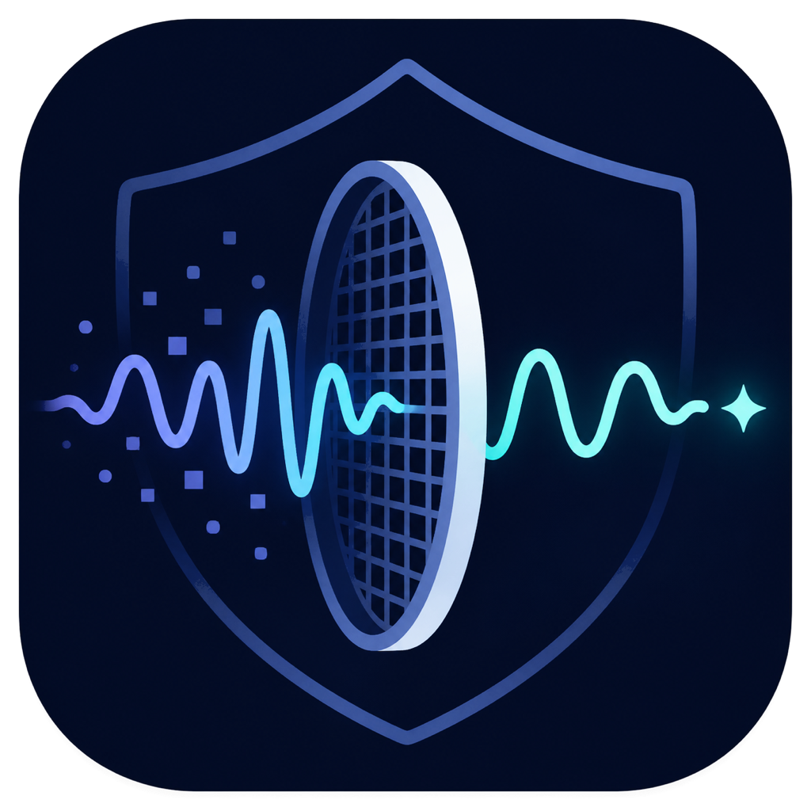

# Signal Sieve

<p align="center">
  
</p>

<p align="center"><strong>Inspect what copied text and files carry before you share them.</strong></p>

Signal Sieve is a privacy-first macOS app for inspecting copied text, code,
links, and file-provenance metadata. Its analyzers make no network requests and
do not save the content you process.

Signal Sieve is an early public release. Reports are evidence for review, not
proof of authorship, malicious intent, AI generation, or guaranteed watermark
removal. Please read [SECURITY.md](SECURITY.md) before using mutation features
on important files.

## Features

- Fresh installations start in English. The language menu switches instantly
  between English, Spanish, and Norwegian Bokmål, and the selected language is
  stored locally for later launches.
- Includes an original dark-blue Signal Sieve icon with a shield, signal, and
  illuminated sieve.
- **Active Guard:** watches for new clipboard content while SignalSieve is running and
  shows a local, actionable notice for hidden Unicode, source-code risks, known
  link trackers, or a repeated pattern across the latest three substantial
  copies. It also recognizes copied images and file references without claiming
  that metadata was found before inspecting the bytes. **Inspect Copied Image**
  pastes the same bounded image representation directly into File Inspector.
  PNG and JPEG bytes are preserved for metadata analysis; TIFF, HEIC, HEIF, and
  GIF representations are normalized locally to PNG with that limitation shown.
  HTML and rich-text representations are inventoried without retaining values.
- Active Guard colors Unicode and code cards from their actual highest risk.
  Only red, high-risk alerts request immediate attention, move to the front,
  and remain above other windows until the user explicitly closes or reviews
  them. Yellow and orange notices keep the standard non-persistent behavior.
- **Session Copy History:** keeps up to 50 recent text copies in local memory
  while Active Guard is running. Each entry shows its exact capture time,
  probable source application, a bounded visible preview, character count, and
  detected risks. The source is inferred from the active application; macOS
  does not provide a trustworthy browser tab or page URL. Concealed,
  transient, and auto-generated pasteboard entries are not retained, long
  entries are truncated, and all history disappears when Signal Sieve exits.
- **Binary Guard:** detects raw binary signatures and null-byte content, plus
  textual payloads represented as Base64, hexadecimal bytes, binary digits, or
  escaped byte sequences. It reports approximate decoded size but never
  decodes, opens, or executes the payload.
- **Code Guard:** recognizes likely source code and shell commands, then reports
  Trojan Source bidirectional controls, invisible token characters, non-ASCII
  whitespace, rich-text punctuation, mixed writing systems, and common Greek or
  Cyrillic look-alikes inside identifiers.
- Code Guard reports line and column, keeps research queries free of copied
  code, and can create sanitized output for side-by-side review. It never
  guesses replacements for confusable identifiers or modifies code
  automatically. Visual Transfer is disabled for detected code because OCR can
  alter syntax.
- **Language detection:** scores distinctive syntax rather than relying on a
  single keyword. It currently identifies Swift, TypeScript, JavaScript, Rust,
  Python, C, C++, Objective-C, Go, Java, Kotlin, C#, Shell, SQL, Solidity, Move,
  Ruby, PHP, Dart, Lua, HTML, CSS, JSON, YAML, and TOML. Explicit Markdown code
  fences are treated as strong evidence. Short shared syntax remains labeled
  **Source code** instead of forcing a language guess.
- Active Guard can clean the current copied link on demand or automatically
  replace future copied links after removing known tracking parameters. It
  verifies that the clipboard has not changed before replacing anything and
  skips automatic link cleaning when the copied text is source code.
- Every warning card explains the finding and includes its own explicit
  **Don't show this warning type again** checkbox. A disabled category can be
  restored later from the **Active Guard** menu, and monitoring can also be
  turned off completely.
- Detects zero-width characters, bidirectional controls, variation selectors,
  Unicode tags, control characters, unusual whitespace, private-use
  characters, and unassigned code points. Context classification distinguishes
  functional emoji composition, script shaping, glyph variation, and bounded
  bidirectional text from characters with no functional context. Green
  contextual findings remain visible for audit but do not trigger warnings or
  count as hidden-payload risk.
- Shows the Unicode code point and position of every finding.
- Every analyzer can copy either its complete findings report or an individual
  finding in a compact plain-text format. Copied reports include risk,
  location, encoding, evidence, fragments, and diffs when available. Invisible
  scalars are written as explicit markers such as `⟦U+200B⟧`, never placed
  invisibly back on the clipboard. Each individual result card has a bordered
  copy control in its lower-right corner.
- Opens a focused DuckDuckGo search when you click a finding. The query includes
  only the Unicode code and element name, never the surrounding text.
- Cleans tracking parameters from links embedded in text while preserving
  functional parameters. This includes `utm_*`, `igsh`, `fbclid`, `gclid`, and
  other widely used campaign identifiers.
- Applies host-scoped share-link rules for Instagram, YouTube, Facebook,
  TikTok, and X, and unwraps known Facebook outbound redirects.
- **Pattern Memory:** compares up to ten recent texts for repeated phrases,
  sentence openings, list structures, and punctuation choices. Samples remain
  in memory for the current session only and disappear when the app exits.
- **Surface Regularity (experimental):** performs a local, keyless stylometric
  screen for observable writing patterns in a single text. It measures repeated
  three-word sequences, moving-window lexical diversity, sentence-length
  cadence, and repeated sentence openings. It requires at least 80 words and
  recommends 180 or more. The aggregate value is explicitly a heuristic score,
  not a probability or provider attribution. Provider-watermark status is
  reported separately as untestable without a compatible detector. Hidden
  Unicode is reported as an exact text-layer result. Every signal can open a generic research
  query that never contains the analyzed text, and the full qualified report is
  copyable.
- **Provider profiles:** keeps provider claims separate from local heuristics.
  The current Claude profile records the provider's documented scope while
  leaving the mechanism undisclosed and the compatible detector unintegrated.
  Future detectors must enter through an explicit adapter boundary; Surface
  Regularity is never treated as a provider detector.
- **File Provenance Inspector:** performs a bounded, read-only scan for C2PA
  container markers and common EXIF, XMP, PNG, JPEG, SVG, PDF, DOCX, ODT, HTML,
  and Markdown metadata structures. PDF inspection uses PDFKit plus structural
  object references; DOCX and ODT parts are read through a bounded ZIP parser.
  It distinguishes a structurally detected container from cryptographic
  validation and does not include private metadata values in copied findings.
  Byte signatures take precedence over filename extensions; mismatches are
  reported explicitly. A PDF header found after leading response or wrapper
  data is identified as an exact container anomaly and refused for cleaning.
  It accepts either a chosen file or **Paste Image** from the current clipboard.
- **Fresh Clean Image:** a pasted image can be decoded into visible pixels and
  rebuilt locally as a new PNG without copying source-container metadata. The
  result is reanalyzed before the app offers **Use This Instead** or **Save Clean
  Image**. Replacing the clipboard requires it to still contain the inspected
  image; if it changed, a second explicit confirmation is required. The source
  bytes remain in inspector memory only. This removes container metadata, not
  watermarks encoded in the visible pixel values.
- **Verified Clean Copy:** removes supported PNG, JPEG, PDF, DOCX, and ODT metadata
  only into a
  newly named file. It never overwrites the source or an existing destination,
  checks that the source did not change during the operation, reopens the saved
  copy, and reports the findings that remain. Color profiles and image data are
  preserved. DOCX cleaning removes its dedicated `docProps` parts while keeping
  the document body and potentially functional `customXml`; ODT receives an
  empty valid `meta.xml`. PDF cleaning uses a pinned, statically linked qpdf
  helper to remove Info, XMP Metadata, PieceInfo, and related modification
  markers, then checks page count, boxes, rotation, annotation types, and the
  reanalyzed output. Signed or encrypted PDFs and signed document packages are
  refused because a safe rewrite cannot be verified.
- **Rewrite Integrity:** compares the current Input and Result locally. It
  reports exact additions or removals of numbers, dates, URLs, and quoted text,
  plus Unicode-aware lexical and length metrics. Semantic equivalence remains
  explicitly untestable, and source code is blocked rather than approved for
  rewriting. An optional local rewrite can call an already-installed Ollama
  model over loopback; Signal Sieve checks that the model already exists and
  never downloads one automatically. The generated text is placed in Result
  for explicit review and is not presented as guaranteed watermark removal.
  Ollama is an optional companion rather than an application dependency:
  inspection, deterministic cleaning, Active Guard, Vaccine, file cleaning,
  and pixel forensics remain available when Ollama is absent or stopped. The
  rewrite screen discovers installed models locally and warns that a rewrite
  can replace one statistical pattern with the local model's own token and
  style bias; its output is not statistically neutral. Generation uses Ollama's
  structured loopback API at the fixed numeric address `127.0.0.1`, delegated
  to Apple's fixed-path `/usr/bin/curl` process with proxy variables removed;
  Signal Sieve contains no general-purpose in-process network client and does
  not expose its own HTTP service.
- **Pixel Watermark Lab (advanced):** includes two offline, model-free modules:
  an LSB Forensics baseline for classic least-significant-bit regularity and a
  Spectral Carrier Lab that measures weak periodic luminance projections across
  a bounded frequency bank. Both can create a verified suppression copy. They
  are forensic heuristics rather than SynthID or provider verdicts and can flag
  natural textures, dithering, resampling, or sensor patterns. The Lab also defines a versioned local
  command-line contract for explicitly selected third-party detector/regenerator modules.
  Signal Sieve stages a copy of the input, bounds process time and output size,
  verifies image dimensions, refuses identical or pre-existing outputs, checks
  that the source stayed unchanged, and reanalyzes metadata in the generated
  copy. No learned detector model is bundled. External executables are a separate
  trust boundary and may ignore the offline environment flags shown by the app. See
  [PIXEL_MODULES.md](PIXEL_MODULES.md) for the complete adapter contract.
- **Private Link Rules:** lets each user add domain-specific parameters that are
  stored locally without retaining full URLs or parameter values.
  Existing TextScrub rules are migrated safely on first launch.
- Includes cryptographic verification primitives for signed community rule
  packs. Automatic downloading remains disabled until trusted signers exist.
- **Safe Clean:** removes dangerous controls while preserving elements that may
  be required by emoji and some writing systems.
- **Strict Clean:** also removes variation selectors, invisible joiners, and
  private-use characters. It may change the appearance of some emoji.
- **Reveal:** opens a local, read-only report for known invisible encodings.
  Valid Unicode Tag, variation-selector, and zero-width binary payloads are
  decoded into selectable text. Byte-aligned opaque payloads are shown as
  hexadecimal bytes, while truncated streams show their recoverable bits,
  mapping, and missing-bit count without guessing the intended message.
- **Visual Transfer:** renders the content to an in-memory bitmap and reads it
  back with Apple Vision, similar to Live Text. This removes data without a
  visual representation, but OCR may introduce errors. Always review the
  result.
- **Vaccine:** scans a user-selected project tree for the same Unicode and code
  risks, language signals, encoded payloads, binary files, and supported
  provenance/metadata structures. Metadata findings are review-only and never
  rewritten by Vaccine. The first pass is report-only. Explicit vaccination
  sanitizes only deterministic safe findings, creates a complete backup of
  every affected file first, preserves
  permissions, and leaves confusable identifiers and encoded data for manual
  review. Symlinks, binary files, oversized files, generated build output, and
  common dependency directories are never rewritten. Files changed after the
  scan are skipped to avoid overwriting concurrent work.
- Vaccine makes invisible findings reviewable with a bounded source fragment.
  It decodes recognizable Unicode Tag, variation-selector byte, and zero-width
  binary payloads into display-only text; unknown encodings are rendered in
  context with markers such as `⟦U+FE0F⟧`. Revealed content is never executed.
- When a zero-width binary stream is damaged or incomplete, Reveal can compare
  it with a small, auditable catalog of known proof-of-concept payloads. Any
  match is labeled as a **probable equivalence**, never an exact decode, and
  includes the recovered characters, Unicode code points, similarity,
  confidence, and binary edit distance. Matching is bounded and entirely local.
- **Signature Hunt:** groups matching invisible signatures across files under
  deterministic `SIG-…` identifiers. Each group reports technique, confidence,
  occurrence and file counts, decoded content when available, encoding, and a
  bounded before/after diff. Signatures are classified as safe to neutralize,
  review-only, or protected. After an explicitly confirmed neutralization it
  rescans the project and reports which safe signature groups disappeared.
  **Copy Signatures** exports the complete report, while the copy button on
  each group exports that signature's ID, classification, visible fragment,
  occurrences, encodings, and diffs.
- **Encoding Guard:** detects and preserves UTF-8, UTF-16 LE/BE, and UTF-32
  LE/BE, with or without a byte-order mark. Vaccine and Signature Hunt write a
  sanitized file back using its original encoding, endianness, and BOM state.
- Projects can add a `.signalsieveignore` file using familiar glob patterns.
  Root-anchored paths, directory patterns, `*`, `?`, and recursive `**` are
  supported. See `.signalsieveignore.example`.
- Vaccine recognizes the Signal Sieve source tree and installed app through
  stable internal identifiers. It permits read-only analysis but blocks any
  attempt to vaccinate itself, protecting intentional security test fixtures.

## Requirements

- macOS 13 or later.
- Xcode Command Line Tools with Swift 6 or a compatible version.
- Git and CMake for the pinned PDF-cleaning helper dependencies.
- Ollama is optional and used only for an explicitly requested local rewrite.

## Build and run

Clone the repository, build the pinned PDF dependencies once, and package the
application:

```sh
cd SignalSieve
./bootstrap-pdf-tools.sh
./package-app.sh
open ".build/app/Signal Sieve.app"
```

You can also double-click `run.command` in Finder. On its first run it builds
the pinned PDF dependencies, creates a locally signed `.app` bundle, and opens
it. Local ad-hoc signing verifies the bundle's integrity on the same Mac; it is
not an Apple Developer ID signature or notarization for public distribution.

For a release-style local verification, run `./quality-gate.sh`. It compiles
with warnings as errors, runs the local unit/integration suite, packages and
validates the app, checks shell syntax, verifies private-framework linkage and
code signing, and enforces static privacy restrictions against adding an
in-process network client or source/test symlinks.

With a complete Xcode installation, you may also use:

```sh
swift run SignalSieve
```

## Tests

Run the complete release-style quality gate:

```sh
./quality-gate.sh
```

Run the warning-free build, core smoke tests, local OCR integration, packaging,
and basic static source checks:

```sh
./check.sh
```

Run only the local compiler-compatible test runner:

```sh
./test-local.sh
```

Run the reusable, read-only real-file quality harness against a directory. It
uses bounded temporary copies for Vaccine and clean-copy verification, removes
them afterward, and never rewrites the corpus:

```sh
./corpus-quality.sh /path/to/corpus
```

With a complete Xcode installation, the source-of-truth unit suite uses Swift
Testing:

```sh
swift test
```

If Swift Package Manager cannot load `SWBBuildService.framework` from a
Command Line Tools-only installation, use `build-local.sh`, `test-local.sh`, or
`quality-gate.sh`. These scripts invoke the compiler directly with the active
macOS SDK. The local runner covers every core subsystem and exercises Apple
Vision OCR as an integration test. The quality gate additionally type-checks
privacy- and mutation-sensitive Unicode, clipboard, file, Vaccine, rewrite,
and external-module restriction tests with Swift Testing's real `@Test`
macros.

## Project structure

- `Sources/SignalSieveCore`: deterministic analysis, cleaning, rule, URL, and OCR
  components with no UI state.
- `Sources/SignalSieve`: SwiftUI composition, focused views, and the app view
  model.
- `Packaging`: macOS application metadata used to create `Signal Sieve.app`.
- `Tests/SignalSieveCoreTests`: fine-grained Swift Testing unit suite.
- `Tests/LocalTestRunner`: dependency-free fallback and OCR integration runner.
- `Tests/CorpusQualityRunner`: bounded real-file invariants for provenance,
  Vaccine, image regeneration, and verified clean copies.
- `ADVANCED_ROADMAP.md`: strict format, controlled-harness, learned-pixel,
  API, and container acceptance criteria.

Continuous integration builds with warnings as errors and runs the Swift
Testing suite on macOS for every push and pull request.

## Contributing and support

Focused issues, tests, documentation, translations, and pull requests are
welcome. Start with [CONTRIBUTING.md](CONTRIBUTING.md) and do not attach private
clipboard contents, tracked URLs, personal rules, or sensitive documents to a
public issue.

If Signal Sieve is useful to you, starring the repository, sharing it, and
testing new formats all help the project. You can also support its continued
development through [Buy Me a Coffee](https://buymeacoffee.com/JACKNINES).
Donations are optional, do not unlock features, and are never requested or
processed inside the application.

## License

Signal Sieve source code is licensed under the
[Mozilla Public License 2.0](LICENSE). MPL's file-level copyleft keeps changes
to covered files open while allowing those files to be combined with separate
open or proprietary components in a larger work. Copyright © 2026 JACKNINES and
Signal Sieve contributors.

The **Signal Sieve** name and logos are not granted under the source-code
license. See [TRADEMARKS.md](TRADEMARKS.md) before naming or branding a fork.
Third-party build dependencies retain their own licenses; see
[THIRD_PARTY_NOTICES.md](THIRD_PARTY_NOTICES.md).

## Security limitations

Signal Sieve identifies known Unicode hiding techniques, not every possible
statistical watermark. Surface Regularity can surface visible writing patterns,
but a provider watermark may be deliberately indistinguishable from ordinary
prose without a compatible detector and validated provider-specific parameters.
A low score therefore cannot rule one out, and a high score can also occur in
human writing.
Visual Transfer removes the original digital layer, but OCR preserves visible
wording, so it cannot guarantee removal of a linguistic or statistical signal.
Shortening, paraphrasing, and back-translation can weaken some published
schemes, but Signal Sieve does not present any of them as a guaranteed scrub.
Code Guard is a review aid rather than a compiler or proof that code is safe.
Its look-alike table covers common Greek and Cyrillic confusables and does not
claim exhaustive Unicode confusable detection.
Language detection is heuristic. Generated code, language mixtures, embedded
DSLs, and very short snippets may be labeled as ambiguous even when Code Guard
correctly recognizes them as source code.
Binary Guard recognizes structures, not intent. Base64 and hexadecimal are
normal engineering formats, so a detection is a prompt to inspect provenance,
not evidence of malware. Vaccine does not replace version control, compiler
checks, dependency scanning, or a malware scanner; review its report and backup
before accepting project-wide changes.
Signature Hunt targets deterministic text-layer signatures only. It does not
remove cryptographic signatures, macOS code signing, arbitrary executable
bytes, or guarantee removal of statistical/linguistic watermarking.
The built-in Pixel Lab modules screen only classic LSB regularity or a bounded
bank of periodic luminance carriers and can produce false positives on natural
noise, textures, dithering, resampling, or sensor patterns. They do not identify
SynthID, authorship, or AI generation. A third-party module still runs
with the user's authority and may access the network despite offline environment
flags; review its source, license, model provenance, and privacy behavior first.

Pattern Memory reports observable correlation only. Its findings are not proof
of authorship, AI generation, or the presence of a watermark.
